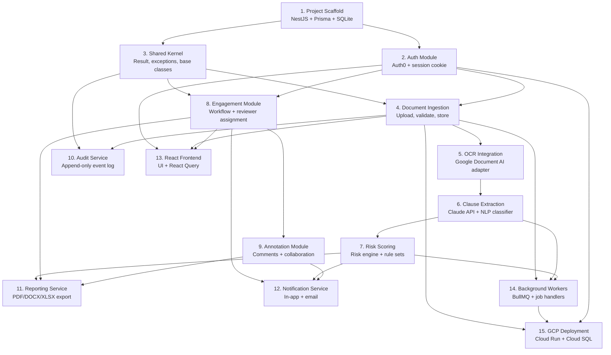

# Design Document: Contract Analysis Platform

## Overview

An AI-powered platform that ingests legal documents, extracts and classifies contractual clauses, scores risk, and orchestrates due diligence workflows for in-house counsel, M&A teams, and law firms.

Built as a **vertically-sliced NestJS monolith** following **Clean Architecture** with a **DDD domain layer** and **CQRS** pattern. Designed for a single developer, deployed to GCP, with a clear path to scale out later.

---

## Architecture Principles

- **Clean Architecture** — dependencies point inward; domain layer has zero framework dependencies
- **DDD Domain Layer** — aggregates, entities, value objects, domain events, factories
- **CQRS** — commands mutate state via use cases; queries bypass the domain and read directly from DB
- **Vertical Slicing** — each feature module owns its full stack (domain → application → infrastructure)
- **Ports & Adapters** — infrastructure concerns (storage, queue, OCR, secrets, logging) are abstracted behind interfaces, swapped via env config
- **TDD** — red → green → refactor; every piece of production code is preceded by a failing test
- **Environment-driven** — behaviour changes via env vars, not code

---

## Tech Stack

| Concern | Technology |
|---|---|
| Backend | NestJS + TypeScript |
| Frontend | React + TypeScript |
| ORM | Prisma |
| Database (production) | PostgreSQL (GCP Cloud SQL) |
| Database (local dev) | SQLite |
| Authentication | Auth0 (hosted Universal Login, session cookie) |
| AI / ML | Claude API (Anthropic) |
| OCR (scanned docs) | Google Document AI |
| Document storage | GCP Cloud Storage |
| Job queue (local) | In-memory |
| Job queue (demo) | pg-boss (PostgreSQL-backed) |
| Job queue (production) | BullMQ + Redis (GCP Memorystore) |
| Logging | pino + nestjs-pino |
| CQRS / Event Bus | @nestjs/cqrs |
| API docs | @nestjs/swagger (OpenAPI) |
| Testing | Jest + Supertest |
| APM (backend) | Dynatrace (OneAgent) |
| APM (frontend) | LogRocket |
| Product analytics | PostHog |
| Resilience | cockatiel (retry, circuit breaker, timeout) |

---

## Deployment Environments

| Concern | Local Dev | Railway (Demo) | GCP (Production) |
|---|---|---|---|
| Database | SQLite | PostgreSQL | Cloud SQL |
| Storage | Local filesystem | GCS bucket | GCS bucket |
| OCR | Mock adapter | Google Document AI | Google Document AI |
| Queue | In-memory | pg-boss | BullMQ + Memorystore |
| Secrets | `.env` file | Railway env vars | GCP Secret Manager |
| Logging | pino-pretty | JSON | JSON → Cloud Logging |

**Local dev**: `npm run dev` — single command, no containers, SQLite, in-memory queue.

**Railway demo**: containerised services, PostgreSQL + Redis managed by Railway, same Docker image as production.

**GCP production**:
- Cloud Run (API service, scales to zero)
- Cloud Run (Worker service, same image, `npm run worker` entrypoint)
- Cloud SQL, Cloud Storage, Memorystore, Secret Manager, Cloud Armor

---

## Cloud Architecture

```
Internet
    │
    ▼
Cloud Armor (WAF / DDoS)
    │
    ▼
Cloud Run — NestJS API
    ├── Cloud SQL (PostgreSQL)
    ├── Cloud Storage (document blobs)
    ├── Cloud Memorystore (Redis / BullMQ)
    ├── Google Document AI (OCR)
    ├── Claude API (Anthropic)
    └── Secret Manager

Cloud Run — Worker Service
    ├── Cloud SQL
    ├── Cloud Storage
    ├── Cloud Memorystore (BullMQ consumer)
    ├── Google Document AI
    └── Claude API
```

Cloud Run, Cloud SQL, and Memorystore live in a private VPC. Cloud SQL has no public IP. Documents served via signed Cloud Storage URLs only.

---

## Application Architecture

### Clean Architecture Layers

```
┌─────────────────────────────────────────┐
│           Infrastructure Layer          │
│  Controllers, Prisma repos, adapters,   │
│  DTOs, filters, guards, mappers         │
├─────────────────────────────────────────┤
│           Application Layer             │
│  Command handlers, Query handlers,      │
│  Event handlers (use cases)             │
├─────────────────────────────────────────┤
│             Domain Layer                │
│  Aggregates, Value Objects, Events,     │
│  Factories, Repository interfaces       │
└─────────────────────────────────────────┘
         ↑ Dependencies point inward
```

### CQRS Flow

```
HTTP Request → Controller
    │
    ├── CommandBus.execute(command)
    │       → CommandHandler → Aggregate → Repository.save()
    │       → EventBus.publishAll(aggregate.pullEvents())
    │           → EventHandler: enqueue job / audit / notify
    │
    └── QueryBus.execute(query)
            → QueryHandler → Prisma (direct read, no domain)
            → ResponseDto
```

### Vertical Slice Structure

```
src/
  modules/
    documents/
      domain/           ← aggregate, value objects, events, factory, repository interface
      application/      ← commands/, queries/, events/
      infrastructure/   ← prisma repo, controller, module, dtos/, mapper
      __tests__/
    clauses/
    engagements/
    annotations/
    reports/
    audit/
    auth/
    processing/         ← background job workers
    shared/             ← shared kernel: ports, exceptions, result, base classes
```

---

## Domain Model

### Bounded Contexts

```
┌──────────────────────┐   ┌──────────────────────┐
│  Document Analysis   │   │  Due Diligence        │
│  Document            │   │  Engagement           │
│  Clause              │   │  ReviewAssignment     │
│  RiskScore           │   │  ReviewProgress       │
└──────────────────────┘   └──────────────────────┘
           │                          │
           └───────────┬──────────────┘
                       │
           ┌──────────────────────┐
           │  Collaboration       │
           │  Annotation          │
           │  Comment             │
           └──────────────────────┘
```

### Aggregate 1: Document

**Value Objects**: `DocumentId`, `FileName`, `DocumentStatus`, `StorageKey`, `FileChecksum`, `FileSizeBytes`

**Domain Events**: `DocumentUploadedEvent`, `DocumentOCRStartedEvent`, `DocumentOCRCompletedEvent`, `DocumentOCRFailedEvent`, `DocumentAnalysisStartedEvent`, `DocumentAnalysisCompletedEvent`, `DocumentAnalysisFailedEvent`, `DocumentReadyForReviewEvent`, `DocumentDeletedEvent`

**Invariants**:
- File size ≤ 50MB (requirements reference 500MB; the platform standardises on 50MB as the enforced limit for phase 1 — see Document Processing Pipeline)
- File type: PDF, DOCX, TIFF, PNG
- Status transitions: `uploaded → queued → ocr_processing → ocr_complete → analyzing → ready | failed`
- Deleted document cannot transition

### Aggregate 2: Clause

**Value Objects**: `ClauseId`, `ClauseType` (15 types), `RiskScore` (0–100), `RiskLevel`, `ClauseReviewStatus`, `ConfidenceScore` (0.0–1.0), `TextPosition`

**Domain Events**: `ClauseExtractedEvent`, `ClauseRiskScoredEvent`, `ClauseReviewStatusChangedEvent`, `ClauseEscalatedEvent`

**Invariants**: `startOffset < endOffset`, `riskScore` in [0,100], `confidence` in [0.0,1.0], clause cannot be approved without prior review

### Aggregate 3: Engagement

**Entities**: `ReviewerAssignment` (userId, role, scope, assignedAt)

**Value Objects**: `EngagementId`, `EngagementStatus`, `EngagementType`, `ReviewScope`, `ReviewProgress`

**Domain Events**: `EngagementCreatedEvent`, `EngagementActivatedEvent`, `ReviewerAssignedEvent`, `EngagementCompletedEvent`, `EngagementArchivedEvent`, `DeadlineApproachingEvent`

**Invariants**: must have ≥1 `lead_reviewer` to activate, reviewer scope enforced, `reviewProgress` in [0.0,1.0], deadline must be future date

### Aggregate 4: Annotation

**Entities**: `Comment` (authorId, text, createdAt)

**Value Objects**: `AnnotationId`, `AnnotationType`, `AnnotationStatus`, `MentionedUsers`

**Domain Events**: `AnnotationAddedEvent`, `AnnotationResolvedEvent`, `UserMentionedEvent`, `ClauseEscalatedEvent`

**Invariants**: text not empty, resolved annotation cannot be re-opened, only author or lead_reviewer can resolve

---

## Document Processing Pipeline

```
Upload → UploadDocumentCommand → UploadDocumentHandler
    ├── Validate (type, size ≤ 50MB)
    ├── Store → Cloud Storage
    ├── DocumentFactory.create() → Document aggregate
    ├── DocumentRepository.save()
    └── EventBus → DocumentUploadedEvent
                        │
                        ▼
              DocumentUploadedHandler
                        └── QueueService.enqueue('process-document')
                                    │
                                    ▼
                          ProcessDocumentWorker (background)
                                    │
                                    ├── IF scanned: Google Document AI → extract text
                                    │
                                    ├── Claude API (single combined call):
                                    │     extract + classify + risk score
                                    │     returns: clauses[], riskScore, riskFlags[], explanation
                                    │
                                    ├── Persist clauses → PostgreSQL
                                    ├── Document status → ready
                                    └── EventBus → DocumentAnalysisCompletedEvent
                                                        ├── Notify reviewers
                                                        └── Update engagement progress
```

**Claude strategy**: single combined call (extract + classify + score). Native PDF for text-based docs. Google Document AI for scanned/image PDFs. **50MB file size limit** (enforced at upload; requirements doc references 500MB but 50MB is the decided limit for phase 1). Chunking as safety net for edge cases.

---

## API Design

### Response Envelope

All responses follow a uniform structure. See `research/api-response-structure.md`.

```json
// Success
{ "success": true, "data": { ... }, "meta": null }

// Paginated
{ "success": true, "data": [...], "meta": { "total": 142, "page": 1, "pageSize": 20, "totalPages": 8 } }

// Error (RFC 7807)
{ "success": false, "error": { "type": "...", "title": "...", "status": 422, "detail": "...", "correlationId": "req-abc", "errors": [] } }
```

### Routing Conventions

- Prefix: `/api/v1/`
- RESTful nouns, plural: `/api/v1/documents`, `/api/v1/engagements`
- Max 2 nesting levels: `/api/v1/documents/:id/clauses`
- `GET` = read, `POST` = create (201), `PATCH` = partial update, `DELETE` = remove (204)

---

## Authentication

Auth0 Universal Login (hosted forms) with **Authorization Code Flow**. Tokens are encrypted server-side using AES-256-CBC with PBKDF2 key derivation and stored in PostgreSQL — they are never sent to the browser. The browser holds only a signed, httpOnly session cookie containing a token reference ID and safe user claims (userId, email, roles). On every request, the backend reads the cookie, fetches the encrypted token record, decrypts it, validates the access token, and refreshes it transparently if expired.

Key security properties:
- Tokens never touch the browser — only a signed reference cookie
- Rotating encryption keys — compromise of one key does not expose all tokens
- Per-token salt — prevents rainbow table attacks across token records
- httpOnly + Secure + SameSite=Strict — cookie cannot be read by JS, not sent cross-origin
- Refresh token rotation — Auth0 issues a new refresh token on each use

See `research/auth0-integration.md` for full implementation details including the Prisma schema, NestJS module structure, SessionAuthGuard, and Auth0 dashboard configuration.

---

## Error Handling

Three-layer exception hierarchy (`DomainException`, `ApplicationException`, `InfrastructureException`). Result pattern in domain layer. Global exception filter catches all, returns RFC 7807. Stack traces never sent to clients.

See `research/error-handling.md` for full implementation details.

---

## Key Cross-Cutting Decisions

| Concern | Decision | Reference |
|---|---|---|
| Infrastructure ports | Ports & adapters, env-driven | `research/infrastructure-ports.md` |
| Configuration | `AppConfigService` one-stop shop, per-env files, startup validation | `research/configuration-service.md` |
| Mapper layer | Persistence ↔ Domain ↔ DTO, never expose Prisma to domain | `research/mapper-layer.md` |
| Error handling | Result pattern (domain), exceptions (app boundary), global filter | `research/error-handling.md` |
| Auth | Auth0 Authorization Code Flow, encrypted token storage, httpOnly cookie | `research/auth0-integration.md` |
| Audit service | Append-only PostgreSQL, domain event handlers, SHA-256 tamper detection, indefinite retention | `research/audit-service.md` |
| Resilience | cockatiel (retry + circuit breaker + timeout) on all external APIs | `research/resilience.md` |
| Observability | Dynatrace (backend), LogRocket (frontend), PostHog (analytics + flags) | `research/observability.md` |
| Structured logging | pino, requestId propagation, GCP Cloud Logging | `research/structured-logging.md` |
| TDD | Red → green → refactor, 3 test layers, factories | `research/tdd-approach.md` |
| API docs | @nestjs/swagger, DTO annotations, Bearer auth in UI, SDK generation | `research/api-documentation.md` |
| Frontend architecture | Backend-driven declarative UI, 11 layers, actions + ui in every response | `research/frontend-architecture.md` |

---

## Open Items

| Item | Status |
|---|---|
| Clause granularity (paragraph vs section level) | **Decided** — paragraph-level for phase 1; section-level grouping as a future enhancement |
| Configurable risk rules per engagement type | **Decided** — supported via database-backed rule sets (see Risk_Engine in domain model; `EngagementType` drives rule set selection) |
| Frontend hosting (NestJS serves React vs Firebase Hosting) | **Decided** — NestJS serves the React build from the same Cloud Run instance for phase 1 |
| Outbox pattern for reliable event delivery | Deferred — in-process EventBus sufficient for phase 1 |
| Multi-tenancy | Explicitly out of scope for phase 1 |
| OpenTelemetry distributed tracing | Deferred — Dynatrace only in phase 1 |
| Domain modeling detail | **Complete** — see Domain Model section above |


---

## Task Dependency Graph

Visual representation of implementation dependencies to guide sequencing. Arrows indicate "must be completed before".



### Critical Path

The critical path for getting to a working end-to-end demo:

```
Scaffold → Shared Kernel → Auth → Document Ingestion → OCR → Clause Extraction → Risk Scoring → Frontend
   T1    →      T3       →  T2  →        T4          →  T5  →       T6          →      T7      →    T13
```

### Parallel Work Opportunities

Once the scaffold and shared kernel are in place, these tracks can proceed in parallel:

| Track A (Core Pipeline) | Track B (Workflow) | Track C (Infrastructure) |
|---|---|---|
| Document Ingestion (T4) | Engagement Module (T8) | Background Workers (T14) |
| OCR Integration (T5) | Annotation Module (T9) | Audit Service (T10) |
| Clause Extraction (T6) | Notification Service (T12) | Reporting Service (T11) |
| Risk Scoring (T7) | | GCP Deployment (T15) |

Track A must complete before Track C workers can be fully wired. Track B can start as soon as Auth and Shared Kernel are done.
